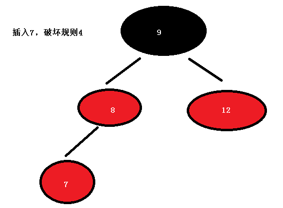
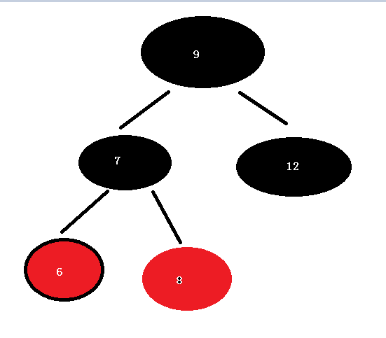

## C++ 容器

## 容器

容器，就是用来存放东西的盒子。

常用的容器包括：数组array,  链表list，  树tree，  栈stack，  队列queue，  散列表hash table,  集合set、映射表map 等等。容器便是容纳这些数据结构的。这些数据结构分为序列式与关联式两种，容器也分为**序列式容器**和**关联式容器**。

STL 标准模板库，核心包括容器、算法、迭代器。

元素排列次序与元素无关，由元素添加到容器的顺序决定

### 序列式容器/顺序容器

| 容器           | 说明                                             |
| -------------- | ------------------------------------------------ |
| vector         | 支持快速随机访问                                 |
| list           | 支持快速插入、删除                               |
| deque          | 双端队列  允许两端都可以进行入队和出队操作的队列 |
| stack          | 后进先出LIFO(Last In First Out)堆栈              |
| queue          | 先进先出FIFO(First Input First Output)队列       |
| priority_queue | 有优先级管理的queue                              |

#### 向量(vector)  

> 连续存储的元素 

**迭代器**

```c
//获得指向首元素的迭代器  模板类，不是指针，当做指针来使用
vector<int>::iterator it = vec.begin();
//遍历元素
for (; it < vec.end(); it++)
{
	cout << *it << endl;
}
//begin和end   分别获得 指向容器第一个元素和最后一个元素下一个位置的迭代器
//rbegin和rend 分别获得 指向容器最后一个元素和第一个元素前一个位置的迭代器

//注意循环中操作元素对迭代器的影响
vector<int>::iterator it = vec.begin();
for (; it < vec.end(); )
{
    //删除值为2的元素 
	if (*it == 2) {
		vec.erase(it);
	}
	else {
		it++;
	}
}
```


#### 列表 (list)

> 由节点组成的双向链表，每个结点包含着一个元素  

#### 双端队列(deque)

> 连续存储的指向不同元素的指针所组成的数组 

#### 栈(stack)

> 后进先出的值的排列 

```c
stack<int> s;
//入栈
s.push(1);
s.push(2);
//弹栈
s.pop();
//栈顶
cout << s.top() << endl;
```


#### 队列(queue)

> 先进先出的值的排列 

```c
queue<int> q;
q.push(1);
q.push(2);
//移除最后一个
q.pop();
//获得第一个
q.front();
//最后一个元素
cout << q.back() << endl;
```

#### 优先队列(priority_queue )

> 元素的次序是由所存储的数据的某个值排列的一种队列 

```c
//最大的在队首
priority_queue<int>;
//在vector之上实现的
priority_queue<int, vector<int>, less<int> >; 
//vector 承载底层数据结构堆的容器
//less 表示数字大的优先级高，而 greater 表示数字小的优先级高
//less  	 让优先队列总是把最大的元素放在队首
//greater    让优先队列总是把最小的元素放在队首

//less和greater都是一个模板结构体 也可以自定义

class Student {
public:
	int grade;
	Student(int grade):grade(grade) {
	}
};
struct cmp {
	bool operator ()(Student* s1, Student* s2) {
        // > 从小到大
        // < 从大到小 
		return s1->grade > s2->grade;
	}
	bool operator ()(Student s1, Student s2) {
		return s1.grade > s2.grade;
	}
};
priority_queue<Student*, vector<Student*>, cmp > q1;
q1.push(new Student(2));
q1.push(new Student(1));
q1.push(new Student(3));
cout << q1.top()->grade << endl;
```

### 关联式容器

> 关联容器和大部分顺序容器操作一致
>
> 关联容器中的元素是按关键字来保存和访问的 支持高效的关键字查找与访问

#### 集合(set)

> 由节点组成的红黑树，每个节点都包含着一个元素,元素不可重复

```c
set<string> a;  
set<string> a1={"fengxin","666"};
a.insert("fengxin");  // 插入一个元素
a.erase("123");	//删除
```

#### 键值对(map)

> 由{键，值}对组成的集合

```c
map<int, string> m;
map<int, string> m1 = { { 1,"dds" },{ 2,"dds" } };
//插入元素
m1.insert({ 3,"ddss" });
//pair=键值对
pair<int, string> p(4, "ddsd");
m1.insert(p);
//insetrt 返回 map<int, string>::iterator : bool 键值对
//如果 插入已经存在的 key，则会插入失败   
//multimap：允许重复key
//使用m1[3] = "xx" 能够覆盖


//通过【key】操作元素
m1[5] = "yihan";
cout << m1[5].c_str() << endl; 
//通过key查找元素
map<int, string>::iterator it = m1.find(3);
cout << (*it).second.c_str()<< endl;
// 删除 
m1.erase(5);
//遍历
for (it = m1.begin(); it != m1.end(); it++)
{
	pair<int, string> item = *it;
	cout << item.first << ":" << item.second.c_str() << endl;
}


```

unordered_map

 c++11取代hash_map（哈希表实现，无序）

哈希表实现查找速度会比RB树实现快,但rb整体更节省内存

需要无序容器，高频快速查找删除，数据量较大用unordered_map；

需要有序容器，查找删除频率稳定，在意内存时用map。

#### 红黑树

红黑树(Red Black Tree)又称为 RB树,是一种相对平衡二叉树 。

> 1.节点是红色或黑色。
>
> 2.根节点是黑色。
>
> 3.每个叶子节点(空节点)都是黑色的。
>
> 4 每个红色节点的两个子节点都是黑色。(从每个叶子到根的所有路径上不能有两个连续的红色节点)
>
> 5.从任一节点到其每个叶子的所有路径都包含相同数目的黑色节点。




> 1. 插入新节点总是红色节点
> 2. 如果插入节点的父节点是黑色, 能维持性质
> 3. 如果插入节点的父节点是红色, 破坏了性质。插入算法就是通过重新着色或旋转, 来维持性质

> 插入 7 后,破坏了规则，那么需要根据不同的状况进行不同的策略使其平衡并符合规则。
>
> 7的父节点8 与叔父节点 12 都是红色，则我们可以将8、12两个重绘为黑色并重绘祖父节点9为红色。
>
> 这里9是根节点，为了满足规则1，又把它重绘为黑色 .
>
> 经过调整：


> 现在满足5个规则，因此7插入完成。
>
> 接下来插入 6


> 现在新节点 6 是 父节点 7的左节点，而6的叔父节点 缺少，父节点 7 又是祖父节点8的左子节点 ，
>
> 这种情形下，我们进行针对6节点的祖父节点8的一次右旋转
>
> 右旋转：
>
> 顺时针旋转红黑树的两个节点，使得父节点被自己的左孩子取代，而自己成为自己的右孩子。
>
> 左旋转则倒过来


> 再切换 7 和 8 的颜色



> 再插入5，5和6都是红色，将 父节点 6 和叔父节点 8 绘为黑色，祖父7设为红色，最终


